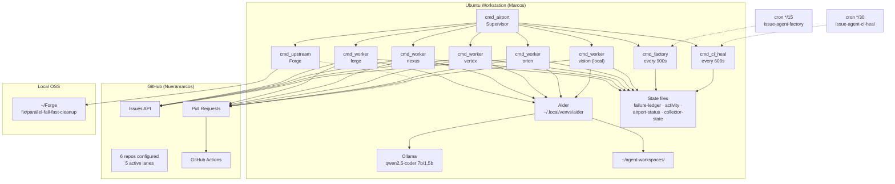
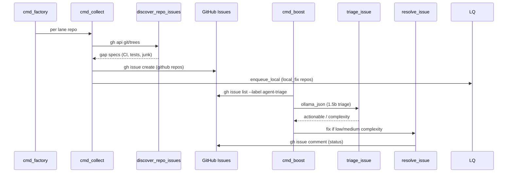
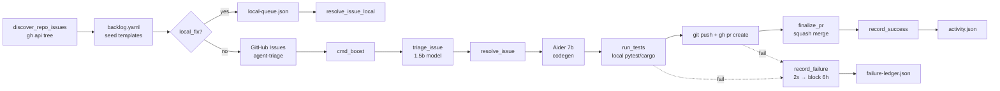

# Issue Agent Airport — Design Document

**Author:** Marcos (Nueramarcos)  
**Date:** 2026-06-18 (rev. 3 — re-review)
**Audience:** Senior engineers + operator (Marcos)  
**Status:** Operational on Ubuntu workstation  
**Primary artifact:** `/home/marcos/issue-agent/issue_agent.py` (~3,018 lines)

---

## Executive Summary

**Issue Agent Airport** is a locally hosted, autonomous GitHub contribution machine running on Marcos's Ubuntu workstation. It continuously:

1. **Discovers** fixable gaps in a **6-repo fleet** (5 active airport lanes + upstream worker; tinygrad paused).
2. **Seeds** `agent-triage` issues from `backlog.yaml` and auto-discovery.
3. **Fixes** issues using **Ollama** (`qwen2.5-coder`) + **Aider** — no cloud LLM for core ops.
4. **Validates** changes with local `pytest` / `cargo test` before push.
5. **Opens and merges** squash PRs via `gh` CLI, with `wait_for_checks: false` to avoid GH Actions queue stalls.
6. **Rotates** across repos in parallel via the **Airport** supervisor — 3-minute default parks (per-repo overrides exist).

The system is designed for **reputation and contribution velocity** on owned repos, with an optional **upstream lane** for OSS work (`0xReLogic/Forge`).

---

## 1. Purpose & Goals

### 1.1 Primary Purpose

Build a **local autonomous GitHub reputation / contribution machine** that:

- Keeps a portfolio of repos green, documented, and CI-backed.
- Produces a steady stream of merged PRs without manual intervention.
- Operates entirely on local compute (Ollama + Aider) except for GitHub API/Actions.

### 1.2 Non-Goals

- Replacing human code review on upstream OSS (Forge PR requires maintainer acceptance).
- Solving complex architectural issues (triage model skips `complexity: high`).
- Waiting indefinitely on GitHub Actions queues (explicitly disabled via `local_first`).

### 1.3 Success Metrics (Observed)

| Signal | Mechanism |
|--------|-----------|
| Merged PRs | `resolve_issue()` → `finalize_pr()` with `--squash --delete-branch` |
| Open `agent-triage` issues | `cmd_collect` / `cmd_factory` |
| Green default-branch CI | `main_branch_ci_state()`, `cmd_ci_heal` |
| Fleet throughput | `airport-status.json` worker heartbeats, `activity.json` |
| Failure containment | `failure-ledger.json` — 2 attempts → 6h block |

---

## 2. Birds-Eye Architecture

### 2.1 System Context

Six repos are configured in `repos.yaml`; **five active airport lanes** plus one **upstream worker** (6 OS processes total). tinygrad is configured but not in active lanes.



### 2.2 Airport vs Legacy Daemon

| Mode | Entry | Concurrency | Interval | Park |
|------|-------|-------------|----------|------|
| **Airport** (current) | `issue-agent-airport` → `cmd_airport` | 5 lane workers + upstream | Per-lane 300–600s | 3 min default (`park_minutes`) |
| **Daemon** (legacy) | `issue-agent-daemon` → `cmd_daemon` | Serial `cmd_fleet` | 3600s default | 2h default |

Airport supersedes the 1-hour daemon loop for throughput. `issue-agent-airport-restart` kills daemon + airport + worker + upstream PIDs before relaunching.

### 2.3 Repository Fleet

Configured in `/home/marcos/issue-agent/repos.yaml` and `/home/marcos/issue-agent/airport.yaml`. Test commands below are **exact** strings from `repos.yaml` (not abbreviated).

| Repo | Kind | Issues API | Branch | CI Workflow | `test_command` (exact) |
|------|------|------------|--------|-------------|------------------------|
| `Nueramarcos/forge-ci-reliability` | github | ✓ | main | CI | `python3 -m pip install -q -r requirements-dev.txt && python3 -m pytest -q` |
| `Nueramarcos/nexus-vision-engine` | github | ✓ | main | CI | `python3 -m pip install -e . -q && python3 -m pytest -q` |
| `Nueramarcos/vertex-sim-core` | github | ✓ | main | CI | `cargo test` |
| `Nueramarcos/orion-ai-agent` | github | ✓ | main | CI | *(none — `detect_test_command()` fallback: `python3 -m pytest -x -q`)* |
| `Nueramarcos/tinygrad` | local | ✗ (fork) | master | Fork Smoke Test | `python3 -m pip install -e . -q && python3 -c "from tinygrad import Device; print(Device.DEFAULT)"` |
| `Nueramarcos/vision` | local | ✗ (fork) | main | Fork Smoke Test | `python3 -m pip install -e . -q && python3 -c "import torchvision; print(torchvision.__version__)"` |

**Fleet vs lanes:** Six repos in `repos.yaml`; **five active airport lanes** (4 github + vision) plus **one upstream supervisor worker**. tinygrad is in `repos.yaml` but **paused** — lane commented out in `airport.yaml`, `fleet-state.json` block until `2026-12-31`.

**Park overrides:** Global airport default is `park_minutes: 3`. Per-repo overrides in `repos.yaml`: `tinygrad` and `vision` use `park_minutes: 15`. `park_hours_for(entry)` prefers per-entry `park_minutes` when `cmd_boost` parks a repo after a failed pass.

**Upstream lane:** `~/Forge` on branch `fix/parallel-fail-fast-cleanup` — validates with `cargo test`, optionally opens PR to configured fork (currently `fork: ""` = test-only).

---

## 3. Core Components

### 3.1 Orchestrator — `issue_agent.py`

Single Python module with argparse subcommands. Key paths:

```
/home/marcos/issue-agent/
├── issue_agent.py              # Main orchestrator (~3,018 lines)
├── tui.py                      # Interactive operator menu (issue-agent-ui)
├── airport.yaml                # Parallel lane config
├── repos.yaml                  # Fleet metadata + test commands
├── backlog.yaml                # Seeded issue templates
├── config.default.toml         # Documented defaults (NOT wired — see §3.2)
├── .issue-agent.yml.example    # Per-repo override template
├── fleet-state.json            # Park/unpark walls
├── failure-ledger.json         # Source of truth: failure tracking
├── failures.json               # Digest: last 100 failure events (FAILURE_DIGEST)
├── collector-state.json        # Last collect run log (not yet tree-hash dedup)
├── ci-heal-state.json          # CI heal scan dedup state
├── ci-heal-queue.json          # Deferred CI repairs
├── local-queue.json            # Local-fix task queue (forks)
├── airport-status.json         # Supervisor + worker heartbeats (merge-patch)
├── activity.json               # Event log (factory, failure, pass) — last 500 events
├── status.json                 # Digest from cmd_status
└── logs/
    ├── airport.log
    ├── worker-*.log
    ├── factory-cron.log
    ├── ci-heal-cron.log
    └── airport-pids/             # {slug}.pid per spawned worker
```

#### Shell Wrapper Pattern

All `/home/marcos/bin/issue-agent*` wrappers share this pattern (not bare `python issue_agent.py`):

```zsh
source "$HOME/.config/cockpit/secrets.env" 2>/dev/null
export PATH="$HOME/.local/bin:$HOME/bin:$HOME/.cargo/bin:$PATH"
export OLLAMA_HOST="${OLLAMA_HOST:-http://127.0.0.1:11434}"
export ISSUE_AGENT_AIRPORT=1   # airport/factory wrappers only
exec "$HOME/.local/venvs/aider/bin/python" "$HOME/issue-agent/issue_agent.py" <subcommand> "$@"
```

Reproduction requires: secrets env, PATH with `gh`/`cargo`, Ollama reachable, Aider venv Python.

#### Operator Entry Points (`/home/marcos/bin/`)

| Group | Script | Maps to |
|-------|--------|---------|
| **Core CLI** | `issue-agent` | Passthrough to `issue_agent.py "$@"` |
| **Supervisor** | `issue-agent-airport` | `airport` (logs to `airport.log`) |
| | `issue-agent-airport-restart` | Kill daemon/airport/worker/upstream PIDs → restart airport |
| **Cron helpers** | `issue-agent-factory` | `factory` (`ISSUE_AGENT_AIRPORT=1`) |
| | `issue-agent-ci-heal` | `ci-heal` |
| **Legacy serial** | `issue-agent-daemon` | `daemon` (1h fleet loop) |
| | `issue-agent-daemon-restart` | Restart daemon |
| | `issue-agent-fleet` | `fleet` |
| **One-shot modes** | `issue-agent-boost` | `boost` |
| | `issue-agent-collect` | `collect` |
| | `issue-agent-local` | `local` |
| | `issue-agent-build` | `build` |
| | `issue-agent-max` | `max` |
| | `issue-agent-relentless` | `relentless` |
| **CI** | `issue-agent-ci-watch` | `ci-watch` |
| | `issue-agent-watch-all` | Daemon launcher (`ISSUE_AGENT_INTERVAL` default 3600s, `ISSUE_AGENT_CI_MAX`) |
| **Interactive** | `issue-agent-ui` | Launches `tui.py` (operator menu) |
| | `issue-agent-open` | Open `issue-agent-ui` in `gnome-terminal` |

See §6.5 for common operator commands.

### 3.2 Configuration Layers

**Actual runtime merge order** (later wins):

1. **`RepoConfig` dataclass defaults** — `model`, `auto_merge: true`, `wait_for_checks: true`
2. **`repos.yaml` per-repo** — `test_command`, `ci_workflows`, `wait_for_checks: false`, `park_minutes`
3. **`airport.yaml` global** — `local_first: true`, `wait_for_checks: false`, `park_minutes: 3`
4. **`.issue-agent.yml` in workspace** — per-repo overrides (optional)

`repo_config()` applies airport `local_first` to disable check-waiting fleet-wide when airport is enabled.

**Not in merge chain:** `config.default.toml` exists at `/home/marcos/issue-agent/config.default.toml` and `CONFIG_DEFAULTS` is defined in `issue_agent.py` (line 31), but **nothing reads it today** — dead configuration path. Values there mirror intent (models, skip_labels) but are not applied unless wired into `repo_config()`. Treat as documentation/deprecated until implemented.

### 3.3 Workspaces

```
~/agent-workspaces/
├── Nueramarcos_forge-ci-reliability/           # Base clone
├── Nueramarcos_forge-ci-reliability-issue-23/    # Per-issue sandbox
└── ...
```

- **Base workspace:** `workspace_for(repo)` — persistent clone, `git pull --ff-only`
- **Issue workspace:** `workspace_for(repo, issue_num)` — `rm -rf` if exists, then `cp -a` from base, isolated branch `fix/issue-{n}`

Clones via `gh repo clone`. Secrets loaded from `~/.config/cockpit/secrets.env`.

---

## 4. How It Navigates GitHub

The agent uses **`gh` CLI** and **`gh api`** exclusively for GitHub interaction — no PyGithub or REST client libraries.

### 4.1 Authentication & Setup

```python
load_secrets()                    # ~/.config/cockpit/secrets.env
run(["gh", "auth", "setup-git"])  # Workers + boost + ci-heal
gh_json(["issue", "view", ...])   # JSON wrapper around gh
```

### 4.2 Repository Inspection

| Operation | Function | GitHub API |
|-----------|----------|------------|
| Clone / sync | `ensure_repo()` | `gh repo clone`, `git fetch/pull` |
| Tree scan | `discover_repo_issues()` | `gh api repos/{repo}/git/trees/{branch}?recursive=1` |
| Issues enabled? | `repo_has_issues()` | `gh repo view --json hasIssuesEnabled` |
| Open issues | `existing_issue_titles()` | `gh issue list` |
| Default branch | `default_branch()` | `gh repo view --json defaultBranchRef` |
| Topics / labels | `cmd_polish()` | `gh label create`, `gh repo edit --add-topic` |

### 4.3 Issue Lifecycle



**Issue creation** (`create_collected_issue`):
```python
gh issue create -R {repo} --title ... --body ... --label agent-triage ...
```

**Triage** (`triage_issue`): Ollama `qwen2.5-coder:1.5b` via `curl` to `/api/generate` (not a native Ollama client). Classifies actionable/complexity. Skips `wontfix`, `question`, `help wanted`, `architecture` labels.

### 4.4 Pull Request & CI Navigation

| Operation | Function | Command |
|-----------|----------|---------|
| Create PR | `resolve_issue()` | `gh pr create --head fix/issue-{n}` |
| Check state | `pr_checks_state()` | `gh pr checks --json name,state,bucket,workflow` |
| Wait (optional) | `wait_for_pr_checks()` | Poll until success/failure/timeout |
| Merge | `finalize_pr()` | `gh pr merge --auto --squash --delete-branch` |
| Failed logs | `fetch_pr_failed_logs()` | `gh run list --status failure` → `gh run view --log-failed` |
| Main CI | `main_branch_ci_state()` | `gh run list --branch main --limit 1` |

**Merge strategy** (`finalize_pr`):
- When `wait_for_checks: false` (airport default): `gh pr merge --auto --squash --delete-branch`, fallback to direct squash merge.
- When checks fail under `wait_for_checks: true`: comment on issue, `enqueue_ci_failure()`.

### 4.5 CI-Aware Filtering (Forks)

Fork repos inherit upstream workflows that may never complete. The agent filters checks to configured `ci_workflows` only:

```python
# repos.yaml
ci_workflows: [CI]              # github repos
ci_workflows: [Fork Smoke Test] # tinygrad, vision
```

`target_workflow_passed()` and `pr_checks_state()` match check names/workflows against these patterns. There is **no** `ignore_workflows` key today — proposed in **PR 3** (see §12 PR Plan).

---

## 5. How It Pumps Solutions

The contribution pump is a closed loop: **discover → seed → triage → fix → test → PR → merge → repeat**.

### 5.1 End-to-End Flow



### 5.2 Issue Factory (`cmd_factory`)

Triggered by:
- Airport supervisor every **900s** (`factory_interval_secs`)
- Cron: `*/15 * * * * issue-agent-factory --max-per-repo 2`

**Repo scope (dual behavior):**
- **Airport mode** (`airport.yaml` lanes non-empty): factory iterates **active lane repos only** (`factory_repos: 5` in `airport-status.json`). tinygrad excluded while lane is commented out.
- **Cron-only / no lanes:** falls back to all entries in `load_repos_config()` (all 6 repos).

Per repo:
1. Runs `cmd_collect` with `discover=True`
2. For `local_fix` repos: enqueues backlog items into `local-queue.json`
3. Writes `collector-state.json` with last-run collected items (see **PR 7** for planned tree-hash dedup)

### 5.3 Auto-Discovery (`discover_repo_issues`)

Inspects the GitHub git tree for:

| Gap | Action |
|-----|--------|
| Junk files (`python `, `path`, etc.) | "Remove accidental junk files" issue |
| No `.github/workflows/` | "Add GitHub Actions CI workflow" |
| No `tests/` (Python repos) | "Add pytest smoke tests" |
| No `requirements-dev.txt` | "Add requirements-dev.txt with pytest" |
| README without badges | "Add README badges" |
| No `CONTRIBUTING.md` | "Add CONTRIBUTING.md" |
| vertex: no issue templates | "Add issue and PR templates" |

### 5.4 Fix Pipeline (`resolve_issue`)

1. **Branch:** `fix/issue-{num}` in isolated workspace
2. **Aider prompt:** `SYSTEM_PROMPT` + issue title/body + `max_files: 8` constraint
3. **Sanitize:** `sanitize_agent_artifacts()` removes files named like shell commands
4. **Test:** `detect_test_command()` or `repos.yaml` override → `run_tests()`
5. **No-op guard:** `has_branch_changes()` — skip if aider produced nothing
6. **Push:** `git push -u origin branch --force-with-lease` (see KD-15)
7. **PR:** `gh pr create` with `Closes #{num}`
8. **Merge:** `finalize_pr()` → squash + delete branch (see KD-13)
9. **Comment:** `gh issue comment` with result

### 5.5 Local-Fix Pipeline (`resolve_issue_local`)

For `tinygrad` and `vision` (issues disabled on fork):

1. Tasks live in `local-queue.json` (not GitHub Issues API)
2. Branch: `fix/local-{slug}`
3. Known CI repairs: `try_known_ci_repair()` bypasses Aider for deterministic fixes
4. Same push → PR → merge path

### 5.6 Boost Priority (`cmd_boost`)

Workers call `cmd_boost` with `fix_max: 1` and **`seed=True`** (default) per pass — this triggers `seed_issue_if_empty()` and `seed_backlog_issues()` on every non-parked worker iteration, not only during factory/cron cadence. Manual `issue-agent boost --no-seed` skips seeding.

`cmd_boost` also always runs `cmd_polish()` before fixes (topics/labels side effects on every boost pass — see KD-14).

Issue priority (`issue_fix_priority`):

| Priority | Issue type |
|----------|------------|
| 0 | Junk / accidental files |
| 1 | README / docs |
| 2 | Smoke tests / `__init__` |
| 3 | CONTRIBUTING |
| 5 | Default |
| 9 | CI / workflow (hardest — tried last) |

After failed pass with 0 fixes: `park_repo()` for `park_hours_for(entry)` (3 min default; 15 min for vision/tinygrad per `repos.yaml`).

### 5.7 CI Heal Loop (`cmd_ci_heal`)

- Airport: every **600s**, `max=2`, `max_per_repo=1`
- Cron: `*/30 * * * * issue-agent-ci-heal --max 2`
- Scans `gh run list --status failure` on default branch
- Applies `try_known_ci_repair()` or Aider via `push_ci_repair_pr()`
- `fork_smoke_healthy()` prevents respawning obsolete tinygrad CI-heal tasks

### 5.8 Failure Ledger

```python
MAX_FAILURE_ATTEMPTS = 2
FAILURE_SKIP_HOURS = 6
```

| Scope | Key format | Behavior |
|-------|------------|----------|
| `issue` | `{repo}::issue::{num}` | Skip issue after 2 failures for 6h |
| `local` | `{repo}::local::{title}` | Skip local task |
| `ci_heal` | `{repo}::ci_heal::default` | Block CI heal retries |

**Semantics:**
- `blocked` + `skip_until` gate `is_failure_blocked()` — the operational skip mechanism.
- `attempts` counter is **monotonic** — it keeps incrementing on continued failures even after `blocked: true` (e.g. `orion-ai-agent::ci_heal::default` shows `attempts: 3` with `max_attempts: 2`).
- When `skip_until` expires, `is_failure_blocked()` clears `skip_until`, resets `attempts` to 0, and unblocks.

`classify_failure()` provides operator hints: `no_commits`, `test_fail`, `ci_timeout`, `ci_fail`, `pr_blocked`, `merge_fail`.

**Two failure files:**
- `failure-ledger.json` — source of truth (`load_failure_ledger()`)
- `failures.json` — rolling digest of last 100 events (`FAILURE_DIGEST`)

### 5.9 Housekeeping

`housekeeping()` runs at worker start and airport supervisor loop (30s):

- `prune_fleet_state()` — unpark expired walls
- `prune_local_queue()` — remove done/stale CI tasks
- `prune_ci_heal_queue()` — dedupe blocked repos
- `close_stale_ci_issues()` — close "Fix CI" issues when main is green

---

## 6. Airport Operational Model

### 6.1 Supervisor Loop (`cmd_airport`)

```
1. Load airport.yaml lanes (5) + upstream (1) = 6 workers
2. spawn_lane_worker() for each → logs/worker-{slug}.log, airport-pids/{slug}.pid
3. Forever (30s tick):
   - Respawn dead workers
   - Every 900s: cmd_factory
   - Every 600s: cmd_ci_heal
   - housekeeping()
   - save airport-status.json heartbeat
```

### 6.2 Lane Worker Loop (`cmd_worker`)

```
Every {interval}s (300–600):
  housekeeping(repo)
  if parked: log "brief park — rotating" (still sleeps, doesn't fix)
  else:
    cmd_collect(discover=True, max=collect_max)
    if kind=local: process_local_queue(max=1)
    else: cmd_boost(max=fix_max, seed=True)   # seed=True every pass
  save worker status to airport-status.json
```

### 6.3 Upstream Worker (`cmd_upstream`)

```
Every 1800s:
  cd ~/Forge
  git fetch && git checkout fix/parallel-fail-fast-cleanup
  cargo test --quiet
  if fork configured and tests pass:
    git push -u {fork_remote} {branch}   # fork = git remote NAME, not just owner/repo
    gh pr create -R {fork_owner_repo} ...
```

When `upstream.fork` is set, it is used as **both** the `gh -R` target for PR creation **and** the **git remote name** in `git push -u fork branch`. A remote named `fork` must exist locally.

### 6.4 Cron Schedule

| Schedule | Command | Log |
|----------|---------|-----|
| `*/15 * * * *` | `issue-agent-factory --max-per-repo 2` | `logs/factory-cron.log` |
| `*/30 * * * *` | `issue-agent-ci-heal --max 2` | `logs/ci-heal-cron.log` |

Cron complements (does not replace) in-process factory/heal inside the airport supervisor. See KD-10 for concurrency implications.

### 6.5 Operator Commands

```bash
# Health check — gh, ollama, aider, fleet, airport, failures
issue-agent status

# Failure summary (currently aliases to status failure section)
issue-agent failures

# Interactive TUI
issue-agent-ui

# Restart airport (kills daemon + workers)
issue-agent-airport-restart

# Manual single-repo fix (use --no-seed to skip backlog seeding)
issue-agent boost Nueramarcos/forge-ci-reliability --max 1 --no-seed

# Seed issues only
issue-agent collect --max-per-repo 2

# One-shot factory
issue-agent factory

# Tail logs
tail -f ~/issue-agent/logs/airport.log
tail -f ~/issue-agent/logs/worker-Nueramarcos_forge-ci-reliability.log

# Trust live workers over stale status keys
ls ~/issue-agent/logs/airport-pids/*.pid
pgrep -af 'issue_agent.py worker'
```

### 6.6 State Files for Observability

| File | Contents |
|------|----------|
| `airport-status.json` | `supervisor_heartbeat`, `last_factory`, per-worker `last_pass` / `started` |
| `fleet-state.json` | `blocked.{repo}.until` park walls |
| `failure-ledger.json` | Source of truth: per-issue/ci_heal failure counts + `skip_until` |
| `failures.json` | Rolling digest (last 100 failure events) |
| `collector-state.json` | Last collect run: `{"collected": [...], "ts": "..."}` |
| `ci-heal-state.json` | CI heal scan dedup state |
| `ci-heal-queue.json` | Deferred CI repair queue |
| `activity.json` | Last 500 events (`log_activity()` truncates to `entries[-500:]`): `factory`, `failure`, `pass`, `worker_start` |
| `status.json` | Digest from `cmd_status` |

**`airport-status.json` merge semantics:** `save_airport_status()` reads existing JSON, merges patch keys, writes back. **Worker keys are never pruned** when lanes are removed — e.g. `worker_Nueramarcos_tinygrad` can persist after tinygrad lane is commented out. **Operator guidance:** trust `logs/airport-pids/*.pid` + `pgrep` for live workers; treat stale worker keys as historical. *(Future PR: prune worker keys not in current `airport.yaml` lanes on supervisor start.)*

---

## 7. Tech Stack

| Layer | Technology | Path / Notes |
|-------|------------|--------------|
| LLM (code) | Ollama `qwen2.5-coder:7b` | `OLLAMA_HOST=http://127.0.0.1:11434` |
| LLM (triage) | Ollama `qwen2.5-coder:1.5b` | `curl` → `/api/generate` (JSON) |
| Code agent | Aider | `~/.local/venvs/aider/bin/aider` |
| GitHub | `gh` CLI | Auth via `gh auth login` |
| Python tests | pytest | Per-repo `test_command` in repos.yaml |
| Rust tests | cargo | vertex + Forge upstream |
| Runtime | Python (Aider venv) | CLI executed via `~/.local/venvs/aider/bin/python` — not system Python; version pinned in venv |
| Config | YAML | `airport.yaml`, `repos.yaml`, `backlog.yaml` (+ unwired `config.default.toml`) |

---

## 8. Limits & Honest Constraints

### 8.1 Model Limitations

- **7B local model** often produces **no diff** on CI/workflow issues (`no_commits` is the top failure class).
- **Triage** skips `complexity: high` — reduces wasted Aider runs but misses harder issues.
- **max_files: 8** prevents runaway edits but limits multi-file refactors.

### 8.2 GitHub Actions Queue

- **tinygrad paused** because fork-smoke workflows sit `pending` for 420s+ (`ci_timeout`).
- Upstream pytorch workflows on forked repos create **check noise** — mitigated by `ci_workflows` filter but not eliminated.
- `wait_for_checks: false` merges without waiting — **local tests are the real gate**, not GH Actions.

### 8.3 Upstream OSS

- Forge lane runs `cargo test` locally but `fork: ""` means **no auto-PR** until configured.
- Maintainer review on `0xReLogic/Forge` is out of scope — agent only prepares the branch.

### 8.4 Token & Resource Limits

- No cloud LLM fallback — if Ollama is down, triage returns `actionable: false` and fixes stop.
- Parallel 6 workers compete for GPU/CPU during Aider runs — no explicit resource scheduler.
- Workspaces accumulate (`*-issue-*` dirs) — no automatic prune policy (see PR 1).

### 8.5 Safety Boundaries

- `SYSTEM_PROMPT` forbids secrets, force-push to main, command-named files.
- `sanitize_agent_artifacts()` cleans model mistakes post-hoc.
- Branch protection on repos could block `--auto` merge — logged as `merge_fail` (see KD-13).

### 8.6 Current Failure Snapshot (2026-06-18T19:38 UTC)

*Illustrative — refresh from `failure-ledger.json` at operate time.*

| Key | Attempts | Blocked | Kind | Detail |
|-----|----------|---------|------|--------|
| `tinygrad::ci_heal::default` | 2/2 | **yes** | no_commits | no CI repair changes |
| `orion-ai-agent::ci_heal::default` | 3/2† | **yes** | no_commits | no CI repair changes |
| `orion-ai-agent::issue::8` | 1/2 | no | no_commits | aider produced no changes |
| `tinygrad::local::Fix CI: Fork Smoke Test failed on master` | 1/2 | no | ci_timeout | pending after 420s |

†Attempts exceed `max_attempts` because counter is monotonic while blocked; gating uses `skip_until`.

**Fleet park:** `tinygrad` in `fleet-state.json` until `2026-12-31` (user pause).

**Runtime note:** `airport-status.json` may show ghost `worker_Nueramarcos_tinygrad` key — lane is inactive; trust PID files.

---

## 9. CLI Reference (Subcommands)

Complete list of **23 subcommands** from `build_parser()`:

| Command | Purpose |
|---------|---------|
| `status` | Health + fleet + airport + failures digest |
| `failures` | Currently aliases to `cmd_status` (prints failure section + `failures.json` path) |
| `list` | List open issues for a repo |
| `triage` | Classify issues with 1.5b model; optional `--apply-label` |
| `fix` | Fix one issue and open PR |
| `run` | Fix issues labeled `agent-triage` (single repo) |
| `demo` | Built-in test issue (no GitHub issue API) |
| `watch` | Poll and fix on interval (single repo) |
| `polish` | Set topics and standard labels on all repos |
| `boost` | Polish + fix agent-triage issues (`--seed` / `--no-seed`) |
| `fleet` | Rotate fleet: 1 issue/repo, park walls |
| `collect` | Discovery + backlog → issues/local queue |
| `max` | Collect + fix+merge (achievement mode) |
| `local` | Process `local-queue.json` |
| `build` | Full pipeline via fleet delegate |
| `relentless` | Boost loop until no open agent-triage issues |
| `ci-heal` | Detect failed CI runs and repair |
| `ci-watch` | Poll CI failures continuously |
| `daemon` | 24/7 fleet loop with housekeeping |
| `airport` | Supervisor — parallel workers + factory + ci-heal |
| `worker` | Single lane loop (spawned by airport) |
| `factory` | Issue factory — discover and seed |
| `upstream` | Forge OSS lane |

---

## 10. File Map (Verified)

```
/home/marcos/
├── issue-agent/
│   ├── issue_agent.py              # ~3,018 lines
│   ├── tui.py                      # Interactive UI (issue-agent-ui)
│   ├── airport.yaml
│   ├── repos.yaml
│   ├── backlog.yaml
│   ├── config.default.toml         # Unwired — deprecated until repo_config() reads it
│   ├── .issue-agent.yml.example
│   ├── fleet-state.json
│   ├── failure-ledger.json
│   ├── failures.json
│   ├── collector-state.json
│   ├── ci-heal-state.json
│   ├── ci-heal-queue.json
│   ├── local-queue.json
│   ├── airport-status.json
│   ├── activity.json
│   ├── status.json
│   └── logs/
│       ├── airport.log
│       ├── worker-*.log
│       ├── factory-cron.log
│       ├── ci-heal-cron.log
│       └── airport-pids/{slug}.pid
├── agent-workspaces/
│   └── Nueramarcos_{repo}[-issue-{n}]/
├── Forge/                          # Upstream (0xReLogic/Forge)
└── bin/
    ├── issue-agent                 # Core passthrough
    ├── issue-agent-airport
    ├── issue-agent-airport-restart
    ├── issue-agent-factory
    ├── issue-agent-ci-heal
    ├── issue-agent-daemon
    ├── issue-agent-daemon-restart
    ├── issue-agent-fleet
    ├── issue-agent-boost
    ├── issue-agent-collect
    ├── issue-agent-local
    ├── issue-agent-build
    ├── issue-agent-max
    ├── issue-agent-relentless
    ├── issue-agent-ci-watch
    ├── issue-agent-watch-all
    ├── issue-agent-ui
    └── issue-agent-open
```

---

## 11. Alternatives Considered

| Alternative | Why rejected | Would revisit if |
|-------------|--------------|------------------|
| **PyGithub / REST client** | `gh` CLI is already authenticated, stable JSON output, zero extra deps; subprocess overhead acceptable on workstation | Need programmatic rate-limit control or batch GraphQL at scale |
| **Cloud LLM (OpenAI/Anthropic API)** | Cost, privacy, network dependency; workstation has Ollama | `no_commits` rate stays >30% on CI issues after **PR 2** deterministic repairs |
| **Serial daemon retention** | 1 fix slot/hour across 6 repos — unacceptable throughput | Airport instability requires fallback — keep `issue-agent-daemon` as escape hatch |
| **`wait_for_checks: true` fleet-wide** | GH Actions queue stalls on forks (tinygrad pending 420s+); blocks merge velocity | **PR 8** `lazy` mode proves stable + ci-heal catches regressions |
| **GitHub App (installation token)** | PAT + `gh auth login` sufficient for single-operator fleet | Multi-user or org-wide deployment |
| **Multi-process without supervisor** | Orphan workers, no respawn, no coordinated factory/heal | Airport supervisor proven fragile — then consider systemd per lane |
| **GitHub Issues for fork repos** | Issues often disabled on forks; local queue decouples from API | GitHub enables issues on all forks + API quota concerns resolved |
| **Direct `git push` without `--force-with-lease`** | Risk overwriting concurrent human pushes on same branch | Never — lease is cheap safety |
| **Wire `config.default.toml` on day one** | YAML per-repo + airport.yaml already sufficient; TOML added as sketch | Operator pain from duplicated defaults across repos |

Each Key Decision (§13) maps to at least one row above.

---

## 12. PR Plan — concrete ordered PRs for future improvements

*Reordered by dependency and failure-mode impact. **PR index:** 1=workspace prune · 2=CI repair module · 3=tinygrad/check filter · 4=resource lock · 5=failures JSON · 6=Forge auto-PR · 7=collector dedup · 8=lazy check-wait · 9=status key prune. **PR 8** amends KD-3 if implemented.*

### PR 1: Workspace lifecycle manager
- Add `cmd_prune-workspaces` integrated with `housekeeping()` scheduler.
- **Safety rules:** exclude dirs where (a) `git status` shows dirty/unmerged state, (b) open PR exists for branch (`gh pr list --head`), (c) dir age < N days with recent mtime.
- Reference existing per-issue teardown in `resolve_issue()` (`rm -rf` before `cp -a`) — prune targets *orphaned* `*-issue-*` dirs only.
- **Rationale:** `~/agent-workspaces/` accumulates dozens of per-issue clones.
- **Depends on:** nothing.

### PR 2: Deterministic CI/workflow fixer module
- Extract `try_known_ci_repair()` (~200+ lines inline today) into `ci_repairs/` with per-repo handlers.
- Invoke before Aider on CI-labeled issues and in `push_ci_repair_pr()`.
- **Rationale:** `no_commits` on CI issues is the dominant failure mode; unblocks PR 3.
- **Depends on:** nothing.

### PR 3: tinygrad lane re-enable with workflow check filter
- **New config** `ignore_workflows: ["(?i)upstream"]` in `repos.yaml` — *does not exist today*.
- Implement in `pr_checks_state()` / `wait_for_pr_checks()`: drop check buckets whose workflow/name matches patterns before evaluating pass/fail.
- Keep gating on `ci_workflows: [Fork Smoke Test]` only.
- **Runbook before unpause:** (1) confirm `fork_smoke_healthy()` true, (2) manual PR merge passes `Fork Smoke Test` within `check_timeout_secs: 420`, (3) uncomment lane in `airport.yaml`, (4) clear `fleet-state.json` tinygrad block, (5) verify KD-8 guard prevents ci-heal respawn.
- **Rationale:** GH Actions stall from inherited upstream workflows, not local smoke test.
- **Depends on:** PR 2 recommended first.

### PR 4: Resource-aware worker scheduling
- Add optional `max_concurrent_aider: 2` in `airport.yaml`; workers acquire file lock before Aider invocation.
- **Rationale:** 6 parallel workers can saturate GPU/RAM during Ollama inference.
- **Depends on:** PR 2/3 stabilize merge rate first (lower priority than CI repair).

### PR 5: Dedicated `cmd_failures` with `--json` output
- **Enhancement, not greenfield:** `failures` subcommand exists today but aliases to `cmd_status` via lambda.
- Implement standalone `cmd_failures` decoupled from full health check.
- JSON schema: `{repo, scope, ident, attempts, max_attempts, blocked, skip_until, kind, hint, detail}` sourced from `failure-ledger.json`; optionally include `failures.json` digest tail.
- **Rationale:** Operators need machine-readable triage without full status overhead.
- **Depends on:** nothing.

### PR 6: Forge upstream auto-PR
- **Not just config:** `upstream.fork` in `airport.yaml` is used as git remote **name** AND `gh -R` target.
- **Operator checklist:**
  1. `cd ~/Forge && git remote add fork git@github.com:Nueramarcos/Forge.git` (or upstream fork policy)
  2. Set `upstream.fork: Nueramarcos/Forge` (owner/repo for `gh pr create -R`)
  3. Confirm `gh auth` can push to remote `fork`
  4. Decide PR target: user fork vs upstream `0xReLogic/Forge` (maintainer review required for latter)
  5. Existing PR detection already in `cmd_upstream` (`gh pr list --head {branch}`)
- **Rationale:** Upstream lane currently only runs `cargo test`.
- **Depends on:** operator remote setup.

### PR 7: Extend `collector-state.json` with tree-hash dedup
- **Extend existing file** at `/home/marcos/issue-agent/collector-state.json` — already written by `cmd_collect()` (`COLLECTOR_STATE.write_text(...)` ~line 2030).
- **Current schema:** `{"collected": [...last run items...], "ts": "..."}` — append log only.
- **Target schema:** add `fingerprints: {repo: tree_sha}`; in `discover_repo_issues` / `cmd_collect`, skip `gh issue create` when tree SHA unchanged.
- **Acceptance criteria:** no duplicate issues for unchanged trees across factory cron + supervisor paths.
- **Rationale:** Factory runs every 15 min; redundant API/title scans.
- **Depends on:** nothing.

### PR 8: Check-wait hybrid mode (`wait_for_checks: lazy`)
- Add `wait_for_checks: lazy` — merge with `--auto` but poll up to `check_timeout_secs`; escalate to ci-heal on failure.
- **Explicitly amends KD-3** — does not replace `local_first` default; opt-in per repo.
- **Rationale:** Pure `false` merges fast but misses CI regressions; pure `true` stalls on queue.
- **Depends on:** PR 2 (CI repair stability) and PR 3 (check filter for forks) before fleet-wide rollout.

### PR 9: Prune stale `airport-status.json` worker keys
- On `cmd_airport` start, remove `worker_*` keys not matching current `airport.yaml` lanes.
- **Rationale:** Prevents ghost entries (e.g. `worker_Nueramarcos_tinygrad` after lane removal).
- **Depends on:** nothing.

---

## 13. Key Decisions — architectural decisions with rationale

### KD-1: Airport parallel lanes over 1-hour daemon
**Decision:** Replace serial `cmd_daemon` (3600s `cmd_fleet`) with `cmd_airport` spawning per-repo workers.  
**Rationale:** Single-threaded fleet rotation meant 5+ repos shared one fix slot per hour. Parallel lanes achieve continuous per-repo iteration.  
**Alternative rejected:** Serial daemon retention — see Alternatives table.

### KD-2: 3-minute parks (`park_minutes: 3`) instead of 2-hour walls
**Decision:** `park_hours_for()` reads `park_minutes` from airport.yaml/repos.yaml; default 3 min. Per-repo overrides: tinygrad/vision use 15 min in `repos.yaml`.  
**Rationale:** 2-hour parks froze unproductive repos too long. Short parks let workers rotate quickly while `failure-ledger` handles per-issue blocking (6h after 2 attempts).

### KD-3: `local_first` + `wait_for_checks: false`
**Decision:** Airport config disables waiting for GH Actions before merge. Local `pytest`/`cargo test` is the gate.  
**Rationale:** GH Actions queue on forks (tinygrad) and shared runners caused multi-hour `pending` states. Local tests provide faster feedback; `ci_heal` handles post-merge failures.  
**Amendment:** PR 8 `lazy` mode is opt-in per-repo extension, not replacement.

### KD-4: Ollama + Aider, no cloud LLM
**Decision:** All codegen and triage via local Ollama models.  
**Rationale:** Cost control, privacy, predictable latency on workstation. Tradeoff: weaker on CI YAML and multi-file changes.  
**Revisit trigger:** `no_commits` >30% on CI issues after deterministic repair module (PR 2).

### KD-5: `agent-triage` label as contract
**Decision:** Only issues labeled `agent-triage` are fixed by `cmd_boost`/`cmd_run`. Factory always adds this label.  
**Rationale:** Prevents agent from touching human-filed issues; provides GitHub-visible queue of agent work.

### KD-6: Local queue for forks (`local_fix: true`)
**Decision:** tinygrad and vision use `local-queue.json` + `resolve_issue_local` instead of GitHub Issues API.  
**Rationale:** Fork repos often have issues disabled; local queue preserves the same discover→fix→PR pipeline without API dependency.

### KD-7: Failure ledger (2 attempts → 6h skip)
**Decision:** `MAX_FAILURE_ATTEMPTS = 2`, `FAILURE_SKIP_HOURS = 6` with classified hints.  
**Rationale:** Prevents infinite retry loops on issues the 7B model cannot solve; time-bounded retry allows model/config improvements.  
**Semantics:** `blocked`/`skip_until` gate retries; `attempts` counter is monotonic and may exceed `max_attempts` while blocked.

### KD-8: `fork_smoke_healthy()` CI-heal guard
**Decision:** Skip ci-heal respawn when `fork-smoke.yml` already contains correct smoke import.  
**Rationale:** tinygrad ci-heal loop burned attempts fixing already-green workflows blocked by upstream check noise.

### KD-9: Issue priority: docs/junk before CI
**Decision:** `issue_fix_priority()` ranks CI/workflow issues last (priority 9).  
**Rationale:** Easy wins (README, junk deletion) merge reliably and build green-repo momentum before hard CI tasks.

### KD-10: Cron + in-process factory/heal redundancy
**Decision:** Both airport supervisor (900s/600s) and cron (15m/30m) run factory and ci-heal.  
**Rationale:** Cron ensures seeding/healing continues even if airport supervisor restarts.  
**Concurrency caveat:** No file locking — `local-queue.json`, `collector-state.json`, `failure-ledger.json` are last-writer-wins. GitHub dedup relies on `existing_issue_titles()` title matching in `cmd_collect`. Concurrent factory runs (supervisor + cron) can race on `gh issue create` — observed benign in practice because title dedup prevents duplicates, but simultaneous writes can drop collector-state entries. Mitigation options: file lock, `last_factory` debounce, or disable cron when airport is running. Redundancy kept for resilience until locking lands.

### KD-11: Upstream lane isolated from fleet workers
**Decision:** `cmd_upstream` runs `cargo test` on `~/Forge` branch, separate from Nueramarcos repo workers.  
**Rationale:** OSS contribution requires different cadence (1800s), different test stack (Rust), and maintainer-gated merge — not mixed with auto-merge fleet.

### KD-12: `sanitize_agent_artifacts()` post-Aider cleanup
**Decision:** Delete files whose names look like shell commands (`python foo.py`, `cargo test`).  
**Rationale:** 7B model occasionally creates junk filenames from prompt examples; these were landing in repos before discovery caught them.

### KD-13: Auto-merge without CI wait (`--auto` squash)
**Decision:** When `wait_for_checks: false`, `finalize_pr()` uses `gh pr merge --auto --squash --delete-branch` with direct squash fallback.  
**Rationale:** Throughput over GH Actions gate; local tests already ran.  
**Risk accepted:** Post-merge CI regressions possible — mitigated by `cmd_ci_heal`. Branch protection may block merge → `merge_fail` (§8.5).

### KD-14: `cmd_polish` coupled to every `cmd_boost` pass
**Decision:** `cmd_boost` always calls `cmd_polish()` before fixing — sets topics/labels on every worker iteration.  
**Rationale:** Keeps repo metadata current without separate cron; side effect is extra `gh` API calls per worker pass.  
**Alternative rejected:** Decoupled polish cron — adds another scheduler; acceptable coupling for small fleet.

### KD-15: `--force-with-lease` on feature branch push
**Decision:** `resolve_issue()` and `resolve_issue_local()` push with `git push -u origin branch --force-with-lease`.  
**Rationale:** Re-running fix on same issue recreates workspace; lease prevents silently overwriting unexpected remote updates while allowing agent idempotent re-push.  
**Alternative rejected:** Plain `--force` — too destructive; no force — fails on retry.

---

*Document rev. 3 — re-review. Runtime snapshot (2026-06-18): airport supervisor running, 4 github workers + vision local + upstream; tinygrad paused; Forge tests passing. Trust `airport-pids/` over stale `airport-status.json` worker keys.*